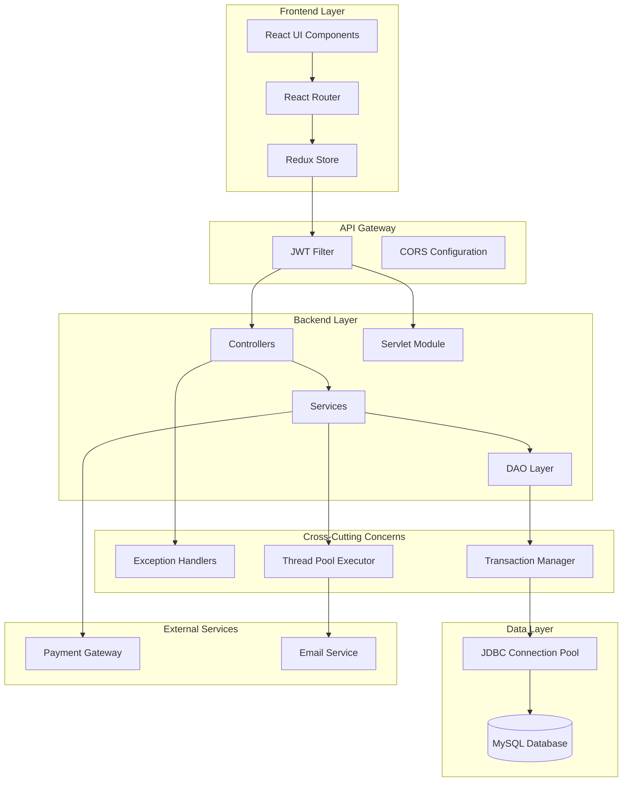

# E-Commerce Platform Design Document

## Overview

The E-Commerce Platform is a full-stack web application built with a Spring Boot backend and React frontend. The system demonstrates advanced Java concepts including OOP principles, JDBC transaction management, multithreading, and servlet integration, while providing a production-ready shopping experience with JWT authentication and payment gateway integration.

### Technology Stack

**Backend:**
- Spring Boot 3.x (REST APIs, Dependency Injection)
- Java 17+ (OOP, Collections, Generics, Multithreading)
- MySQL 8.x with JDBC + JPA/Hibernate
- Maven (Build Tool)
- JWT (Authentication)
- Razorpay/Stripe SDK (Payment Processing)

**Frontend:**
- React 18+ with Vite
- Redux Toolkit (State Management)
- React Router (Navigation)
- Axios (HTTP Client)
- Tailwind CSS / Material-UI (Styling)

## Architecture

### High-Level Architecture



### Layered Architecture Pattern

The system follows a strict layered architecture:

1. **Presentation Layer**: React components and Redux state management
2. **API Layer**: Spring Boot REST controllers and servlet module
3. **Business Logic Layer**: Service classes implementing business rules
4. **Data Access Layer**: DAO interfaces and implementations with JDBC
5. **Database Layer**: MySQL with normalized schema

### OOP Design Principles

**Inheritance Hierarchy:**
```
User (Abstract Base Class)
├── Customer (extends User)
└── Admin (extends User)

Payment (Interface)
├── RazorpayPayment (implements Payment)
└── StripePayment (implements Payment)

BaseDAO<T> (Generic Abstract Class)
├── UserDAO (extends BaseDAO<User>)
├── ProductDAO (extends BaseDAO<Product>)
├── OrderDAO (extends BaseDAO<Order>)
└── CartDAO (extends BaseDAO<CartItem>)
```

**Polymorphism:**
- Service interfaces with multiple implementations
- Payment gateway abstraction with provider-specific implementations
- DAO generic operations overridden for specific entity behavior

**Abstraction:**
- All services defined as interfaces (IUserService, IProductService, etc.)
- DAO layer abstracted through generic BaseDAO interface
- Payment processing abstracted through Payment interface

**Encapsulation:**
- All model classes use private fields with getters/setters
- Business logic encapsulated in service layer
- Database operations encapsulated in DAO layer

## Components and Interfaces

### Backend Components

#### 1. Model Layer (com.ecommerce.model)

**User Hierarchy:**
```java
public abstract class User {
    private Long id;
    private String email;
    private String password;
    private String firstName;
    private String lastName;
    private LocalDateTime createdAt;
    private UserRole role;
    // Getters, setters, abstract methods
}

public class Customer extends User {
    private String shippingAddress;
    private String phoneNumber;
    private List<Order> orders;
}

public class Admin extends User {
    private String department;
    private AccessLevel accessLevel;
}
```

**Product Model:**
```java
public class Product {
    private Long id;
    private String name;
    private String description;
    private BigDecimal price;
    private Integer stockQuantity;
    private String category;
    private String imageUrl;
    private LocalDateTime createdAt;
}
```

**Order Model:**
```java
public class Order {
    private Long id;
    private Long userId;
    private List<OrderItem> items;
    private BigDecimal totalAmount;
    private OrderStatus status;
    private String paymentId;
    private LocalDateTime orderDate;
}
```

**Cart Model:**
```java
public class CartItem {
    private Long id;
    private Long userId;
    private Long productId;
    private Integer quantity;
    private BigDecimal price;
}
```


#### 2. DAO Layer (com.ecommerce.dao)

**Generic Base DAO:**
```java
public interface BaseDAO<T> {
    T save(T entity) throws SQLException;
    T findById(Long id) throws SQLException;
    List<T> findAll() throws SQLException;
    T update(T entity) throws SQLException;
    boolean delete(Long id) throws SQLException;
}

public abstract class AbstractDAO<T> implements BaseDAO<T> {
    protected Connection getConnection() throws SQLException;
    protected void closeResources(Connection conn, PreparedStatement stmt, ResultSet rs);
    // Common JDBC operations with transaction support
}
```

**Specific DAOs:**
- UserDAO: User CRUD with authentication queries
- ProductDAO: Product management with inventory operations
- OrderDAO: Order persistence with transaction support
- CartDAO: Cart operations with user-specific queries
- WishlistDAO: Wishlist management

**Transaction Management:**
```java
public class TransactionManager {
    public <T> T executeInTransaction(TransactionCallback<T> callback) {
        Connection conn = null;
        try {
            conn = dataSource.getConnection();
            conn.setAutoCommit(false);
            T result = callback.execute(conn);
            conn.commit();
            return result;
        } catch (Exception e) {
            if (conn != null) conn.rollback();
            throw new TransactionException("Transaction failed", e);
        } finally {
            if (conn != null) conn.close();
        }
    }
}
```

#### 3. Service Layer (com.ecommerce.service)

**User Service:**
```java
public interface IUserService {
    UserDTO register(RegisterRequest request);
    LoginResponse login(LoginRequest request);
    UserDTO getUserProfile(Long userId);
    UserDTO updateProfile(Long userId, UpdateProfileRequest request);
}

@Service
public class UserServiceImpl implements IUserService {
    private final UserDAO userDAO;
    private final PasswordEncoder passwordEncoder;
    private final JwtTokenProvider jwtTokenProvider;
    // Implementation with OOP principles
}
```

**Product Service:**
```java
public interface IProductService {
    ProductDTO createProduct(CreateProductRequest request);
    ProductDTO updateProduct(Long id, UpdateProductRequest request);
    void deleteProduct(Long id);
    ProductDTO getProductById(Long id);
    List<ProductDTO> getAllProducts(ProductFilter filter);
    List<ProductDTO> searchProducts(String query);
}
```

**Cart Service:**
```java
public interface ICartService {
    CartDTO addToCart(Long userId, AddToCartRequest request);
    CartDTO updateCartItem(Long userId, Long itemId, Integer quantity);
    void removeFromCart(Long userId, Long itemId);
    CartDTO getCart(Long userId);
    void clearCart(Long userId);
}

// Uses ConcurrentHashMap for thread-safe cart operations
```

**Order Service:**
```java
public interface IOrderService {
    OrderDTO createOrder(Long userId, CreateOrderRequest request);
    OrderDTO getOrderById(Long orderId);
    List<OrderDTO> getUserOrders(Long userId);
    OrderDTO updateOrderStatus(Long orderId, OrderStatus status);
    PaymentResponse processPayment(Long orderId, PaymentRequest request);
}
```


#### 4. Controller Layer (com.ecommerce.controller)

**REST Controllers:**
```java
@RestController
@RequestMapping("/api/auth")
public class AuthController {
    @PostMapping("/register")
    public ResponseEntity<UserDTO> register(@Valid @RequestBody RegisterRequest request);
    
    @PostMapping("/login")
    public ResponseEntity<LoginResponse> login(@Valid @RequestBody LoginRequest request);
}

@RestController
@RequestMapping("/api/products")
public class ProductController {
    @GetMapping
    public ResponseEntity<List<ProductDTO>> getAllProducts(@RequestParam Map<String, String> filters);
    
    @GetMapping("/{id}")
    public ResponseEntity<ProductDTO> getProduct(@PathVariable Long id);
    
    @PostMapping
    @PreAuthorize("hasRole('ADMIN')")
    public ResponseEntity<ProductDTO> createProduct(@Valid @RequestBody CreateProductRequest request);
}

@RestController
@RequestMapping("/api/cart")
public class CartController {
    @GetMapping
    public ResponseEntity<CartDTO> getCart(@AuthenticationPrincipal UserDetails user);
    
    @PostMapping("/items")
    public ResponseEntity<CartDTO> addToCart(@RequestBody AddToCartRequest request);
}

@RestController
@RequestMapping("/api/orders")
public class OrderController {
    @PostMapping
    public ResponseEntity<OrderDTO> createOrder(@RequestBody CreateOrderRequest request);
    
    @PostMapping("/{id}/payment")
    public ResponseEntity<PaymentResponse> processPayment(@PathVariable Long id, @RequestBody PaymentRequest request);
}
```

#### 5. Servlet Module (com.ecommerce.servlet)

**Admin Servlet for Product Upload:**
```java
@WebServlet("/admin/product-upload")
public class ProductUploadServlet extends HttpServlet {
    
    @Override
    protected void doGet(HttpServletRequest request, HttpServletResponse response) {
        // Check admin session
        HttpSession session = request.getSession(false);
        if (session == null || session.getAttribute("adminUser") == null) {
            response.sendRedirect("/admin/login");
            return;
        }
        // Display product upload form
    }
    
    @Override
    protected void doPost(HttpServletRequest request, HttpServletResponse response) {
        // Validate session
        // Parse form data
        // Create product using ProductDAO
        // Handle file upload for product image
        // Redirect with success/error message
    }
}

@WebServlet("/admin/login")
public class AdminLoginServlet extends HttpServlet {
    @Override
    protected void doPost(HttpServletRequest request, HttpServletResponse response) {
        String username = request.getParameter("username");
        String password = request.getParameter("password");
        // Authenticate admin
        // Create session
        // Redirect to admin dashboard
    }
}
```

#### 6. Multithreading Components (com.ecommerce.async)

**Email Service with ExecutorService:**
```java
@Service
public class AsyncEmailService {
    private final ExecutorService executorService;
    
    public AsyncEmailService() {
        this.executorService = Executors.newFixedThreadPool(5);
    }
    
    public void sendOrderConfirmationAsync(Order order, String email) {
        executorService.submit(() -> {
            try {
                sendEmail(email, "Order Confirmation", generateOrderEmail(order));
            } catch (Exception e) {
                log.error("Failed to send email", e);
            }
        });
    }
    
    public void sendBulkPromotionalEmails(List<String> emails, String content) {
        emails.forEach(email -> 
            executorService.submit(() -> sendEmail(email, "Promotion", content))
        );
    }
}
```

**Background Order Processor:**
```java
@Service
public class OrderProcessorService {
    private final ScheduledExecutorService scheduler;
    
    public void processOrdersInBackground(List<Order> orders) {
        orders.forEach(order -> 
            scheduler.submit(() -> {
                synchronized(inventoryLock) {
                    updateInventory(order);
                    updateOrderStatus(order);
                }
            })
        );
    }
}
```

**Inventory Update Service:**
```java
@Service
public class InventoryUpdateService {
    private final ConcurrentHashMap<Long, AtomicInteger> stockCache;
    private final ReentrantLock inventoryLock = new ReentrantLock();
    
    public void updateStockAsync(Long productId, int quantity) {
        CompletableFuture.runAsync(() -> {
            inventoryLock.lock();
            try {
                AtomicInteger stock = stockCache.get(productId);
                stock.addAndGet(quantity);
                persistToDatabase(productId, stock.get());
            } finally {
                inventoryLock.unlock();
            }
        });
    }
}
```


#### 7. Payment Gateway Integration (com.ecommerce.payment)

**Payment Interface:**
```java
public interface PaymentGateway {
    PaymentResponse createPaymentOrder(BigDecimal amount, String currency, Map<String, String> metadata);
    PaymentResponse verifyPayment(String paymentId, String signature);
    RefundResponse initiateRefund(String paymentId, BigDecimal amount);
}

@Service
public class RazorpayPaymentService implements PaymentGateway {
    private final RazorpayClient razorpayClient;
    
    @Override
    public PaymentResponse createPaymentOrder(BigDecimal amount, String currency, Map<String, String> metadata) {
        // Razorpay-specific implementation
    }
}

@Service
public class StripePaymentService implements PaymentGateway {
    private final Stripe stripe;
    
    @Override
    public PaymentResponse createPaymentOrder(BigDecimal amount, String currency, Map<String, String> metadata) {
        // Stripe-specific implementation
    }
}
```

#### 8. Security Configuration (com.ecommerce.config)

**JWT Configuration:**
```java
@Configuration
@EnableWebSecurity
public class SecurityConfig {
    
    @Bean
    public SecurityFilterChain filterChain(HttpSecurity http) {
        http
            .csrf().disable()
            .authorizeHttpRequests(auth -> auth
                .requestMatchers("/api/auth/**", "/api/products/**").permitAll()
                .requestMatchers("/api/admin/**").hasRole("ADMIN")
                .anyRequest().authenticated()
            )
            .sessionManagement().sessionCreationPolicy(SessionCreationPolicy.STATELESS)
            .and()
            .addFilterBefore(jwtAuthenticationFilter, UsernamePasswordAuthenticationFilter.class);
        return http.build();
    }
}

@Component
public class JwtTokenProvider {
    public String generateToken(UserDetails userDetails);
    public boolean validateToken(String token);
    public String getUsernameFromToken(String token);
}
```

#### 9. Exception Handling (com.ecommerce.exception)

**Custom Exception Hierarchy:**
```java
public class ECommerceException extends RuntimeException {
    private final ErrorCode errorCode;
}

public class UserNotFoundException extends ECommerceException {}
public class ProductNotFoundException extends ECommerceException {}
public class InsufficientStockException extends ECommerceException {}
public class PaymentFailedException extends ECommerceException {}
public class TransactionException extends ECommerceException {}
public class UnauthorizedException extends ECommerceException {}

@RestControllerAdvice
public class GlobalExceptionHandler {
    @ExceptionHandler(UserNotFoundException.class)
    public ResponseEntity<ErrorResponse> handleUserNotFound(UserNotFoundException ex);
    
    @ExceptionHandler(PaymentFailedException.class)
    public ResponseEntity<ErrorResponse> handlePaymentFailed(PaymentFailedException ex);
    
    @ExceptionHandler(Exception.class)
    public ResponseEntity<ErrorResponse> handleGenericException(Exception ex);
}
```

### Frontend Components

#### 1. Redux Store Structure

```javascript
store/
├── slices/
│   ├── authSlice.js        // User authentication state
│   ├── productSlice.js     // Product catalog state
│   ├── cartSlice.js        // Shopping cart state
│   ├── orderSlice.js       // Order history state
│   └── uiSlice.js          // UI state (loading, errors)
└── store.js                // Redux store configuration
```

**Auth Slice:**
```javascript
const authSlice = createSlice({
  name: 'auth',
  initialState: { user: null, token: null, isAuthenticated: false },
  reducers: {
    loginSuccess: (state, action) => {
      state.user = action.payload.user;
      state.token = action.payload.token;
      state.isAuthenticated = true;
    },
    logout: (state) => {
      state.user = null;
      state.token = null;
      state.isAuthenticated = false;
    }
  }
});
```


#### 2. React Component Structure

```
src/
├── components/
│   ├── common/
│   │   ├── Header.jsx
│   │   ├── Footer.jsx
│   │   ├── Navbar.jsx
│   │   └── LoadingSpinner.jsx
│   ├── auth/
│   │   ├── LoginForm.jsx
│   │   ├── SignupForm.jsx
│   │   └── ProtectedRoute.jsx
│   ├── products/
│   │   ├── ProductCard.jsx
│   │   ├── ProductList.jsx
│   │   ├── ProductDetails.jsx
│   │   ├── ProductFilter.jsx
│   │   └── SearchBar.jsx
│   ├── cart/
│   │   ├── CartItem.jsx
│   │   ├── CartSummary.jsx
│   │   └── CartPage.jsx
│   ├── checkout/
│   │   ├── CheckoutForm.jsx
│   │   ├── ShippingAddress.jsx
│   │   └── OrderSummary.jsx
│   ├── payment/
│   │   ├── PaymentForm.jsx
│   │   └── PaymentSuccess.jsx
│   └── orders/
│       ├── OrderList.jsx
│       ├── OrderDetails.jsx
│       └── OrderTracking.jsx
├── pages/
│   ├── HomePage.jsx
│   ├── LoginPage.jsx
│   ├── SignupPage.jsx
│   ├── ProductListPage.jsx
│   ├── ProductDetailsPage.jsx
│   ├── CartPage.jsx
│   ├── CheckoutPage.jsx
│   ├── PaymentPage.jsx
│   └── OrdersPage.jsx
├── services/
│   ├── api.js              // Axios configuration
│   ├── authService.js
│   ├── productService.js
│   ├── cartService.js
│   └── orderService.js
└── utils/
    ├── validators.js
    ├── formatters.js
    └── constants.js
```

#### 3. API Service Layer

```javascript
// api.js - Axios instance with interceptors
const api = axios.create({
  baseURL: 'http://localhost:8080/api',
  headers: { 'Content-Type': 'application/json' }
});

api.interceptors.request.use(config => {
  const token = localStorage.getItem('token');
  if (token) {
    config.headers.Authorization = `Bearer ${token}`;
  }
  return config;
});

// productService.js
export const productService = {
  getAllProducts: (filters) => api.get('/products', { params: filters }),
  getProductById: (id) => api.get(`/products/${id}`),
  searchProducts: (query) => api.get('/products/search', { params: { q: query } })
};

// cartService.js
export const cartService = {
  getCart: () => api.get('/cart'),
  addToCart: (productId, quantity) => api.post('/cart/items', { productId, quantity }),
  updateCartItem: (itemId, quantity) => api.put(`/cart/items/${itemId}`, { quantity }),
  removeFromCart: (itemId) => api.delete(`/cart/items/${itemId}`)
};
```

## Data Models

### Database Schema

**Users Table:**
```sql
CREATE TABLE users (
    id BIGINT PRIMARY KEY AUTO_INCREMENT,
    email VARCHAR(255) UNIQUE NOT NULL,
    password VARCHAR(255) NOT NULL,
    first_name VARCHAR(100) NOT NULL,
    last_name VARCHAR(100) NOT NULL,
    role ENUM('CUSTOMER', 'ADMIN') NOT NULL,
    created_at TIMESTAMP DEFAULT CURRENT_TIMESTAMP,
    updated_at TIMESTAMP DEFAULT CURRENT_TIMESTAMP ON UPDATE CURRENT_TIMESTAMP,
    INDEX idx_email (email)
);
```

**Customers Table (Extends Users):**
```sql
CREATE TABLE customers (
    user_id BIGINT PRIMARY KEY,
    phone_number VARCHAR(20),
    shipping_address TEXT,
    FOREIGN KEY (user_id) REFERENCES users(id) ON DELETE CASCADE
);
```

**Admins Table (Extends Users):**
```sql
CREATE TABLE admins (
    user_id BIGINT PRIMARY KEY,
    department VARCHAR(100),
    access_level ENUM('FULL', 'LIMITED') DEFAULT 'LIMITED',
    FOREIGN KEY (user_id) REFERENCES users(id) ON DELETE CASCADE
);
```

**Products Table:**
```sql
CREATE TABLE products (
    id BIGINT PRIMARY KEY AUTO_INCREMENT,
    name VARCHAR(255) NOT NULL,
    description TEXT,
    price DECIMAL(10, 2) NOT NULL,
    stock_quantity INT NOT NULL DEFAULT 0,
    category VARCHAR(100),
    image_url VARCHAR(500),
    created_at TIMESTAMP DEFAULT CURRENT_TIMESTAMP,
    updated_at TIMESTAMP DEFAULT CURRENT_TIMESTAMP ON UPDATE CURRENT_TIMESTAMP,
    INDEX idx_category (category),
    INDEX idx_price (price)
);
```

**Cart Items Table:**
```sql
CREATE TABLE cart_items (
    id BIGINT PRIMARY KEY AUTO_INCREMENT,
    user_id BIGINT NOT NULL,
    product_id BIGINT NOT NULL,
    quantity INT NOT NULL DEFAULT 1,
    price DECIMAL(10, 2) NOT NULL,
    created_at TIMESTAMP DEFAULT CURRENT_TIMESTAMP,
    FOREIGN KEY (user_id) REFERENCES users(id) ON DELETE CASCADE,
    FOREIGN KEY (product_id) REFERENCES products(id) ON DELETE CASCADE,
    UNIQUE KEY unique_user_product (user_id, product_id)
);
```

**Orders Table:**
```sql
CREATE TABLE orders (
    id BIGINT PRIMARY KEY AUTO_INCREMENT,
    user_id BIGINT NOT NULL,
    total_amount DECIMAL(10, 2) NOT NULL,
    status ENUM('PENDING', 'PROCESSING', 'SHIPPED', 'DELIVERED', 'CANCELLED') DEFAULT 'PENDING',
    payment_id VARCHAR(255),
    payment_status ENUM('PENDING', 'COMPLETED', 'FAILED') DEFAULT 'PENDING',
    shipping_address TEXT NOT NULL,
    order_date TIMESTAMP DEFAULT CURRENT_TIMESTAMP,
    FOREIGN KEY (user_id) REFERENCES users(id),
    INDEX idx_user_id (user_id),
    INDEX idx_status (status)
);
```

**Order Items Table:**
```sql
CREATE TABLE order_items (
    id BIGINT PRIMARY KEY AUTO_INCREMENT,
    order_id BIGINT NOT NULL,
    product_id BIGINT NOT NULL,
    quantity INT NOT NULL,
    price DECIMAL(10, 2) NOT NULL,
    FOREIGN KEY (order_id) REFERENCES orders(id) ON DELETE CASCADE,
    FOREIGN KEY (product_id) REFERENCES products(id)
);
```

**Wishlist Table:**
```sql
CREATE TABLE wishlist (
    id BIGINT PRIMARY KEY AUTO_INCREMENT,
    user_id BIGINT NOT NULL,
    product_id BIGINT NOT NULL,
    added_at TIMESTAMP DEFAULT CURRENT_TIMESTAMP,
    FOREIGN KEY (user_id) REFERENCES users(id) ON DELETE CASCADE,
    FOREIGN KEY (product_id) REFERENCES products(id) ON DELETE CASCADE,
    UNIQUE KEY unique_user_product (user_id, product_id)
);
```


### Collections and Generics Usage

**In Services:**
```java
// Using List for product collections
List<Product> products = new ArrayList<>();

// Using Map for cart management (userId -> cart items)
Map<Long, List<CartItem>> userCarts = new ConcurrentHashMap<>();

// Using Set for unique categories
Set<String> categories = new HashSet<>();

// Generic service methods
public <T> List<T> filterByPredicate(List<T> items, Predicate<T> predicate) {
    return items.stream().filter(predicate).collect(Collectors.toList());
}
```

**In DAO Layer:**
```java
// Generic DAO with type parameter
public class GenericDAOImpl<T, ID> implements GenericDAO<T, ID> {
    private final Class<T> entityClass;
    
    public GenericDAOImpl(Class<T> entityClass) {
        this.entityClass = entityClass;
    }
    
    public List<T> findAll() throws SQLException {
        List<T> results = new ArrayList<>();
        // JDBC query and result mapping
        return results;
    }
}
```

## Error Handling

### Exception Handling Strategy

**1. Custom Exception Hierarchy:**
- Base: `ECommerceException`
- Business Logic: `UserNotFoundException`, `ProductNotFoundException`, `InsufficientStockException`
- Payment: `PaymentFailedException`, `PaymentVerificationException`
- Data Access: `TransactionException`, `DatabaseException`
- Security: `UnauthorizedException`, `InvalidTokenException`

**2. Global Exception Handler:**
```java
@RestControllerAdvice
public class GlobalExceptionHandler {
    
    @ExceptionHandler(UserNotFoundException.class)
    public ResponseEntity<ErrorResponse> handleUserNotFound(UserNotFoundException ex) {
        ErrorResponse error = new ErrorResponse(
            HttpStatus.NOT_FOUND.value(),
            "User not found",
            ex.getMessage(),
            LocalDateTime.now()
        );
        return new ResponseEntity<>(error, HttpStatus.NOT_FOUND);
    }
    
    @ExceptionHandler(InsufficientStockException.class)
    public ResponseEntity<ErrorResponse> handleInsufficientStock(InsufficientStockException ex) {
        ErrorResponse error = new ErrorResponse(
            HttpStatus.BAD_REQUEST.value(),
            "Insufficient stock",
            ex.getMessage(),
            LocalDateTime.now()
        );
        return new ResponseEntity<>(error, HttpStatus.BAD_REQUEST);
    }
    
    @ExceptionHandler(PaymentFailedException.class)
    public ResponseEntity<ErrorResponse> handlePaymentFailed(PaymentFailedException ex) {
        ErrorResponse error = new ErrorResponse(
            HttpStatus.PAYMENT_REQUIRED.value(),
            "Payment failed",
            ex.getMessage(),
            LocalDateTime.now()
        );
        return new ResponseEntity<>(error, HttpStatus.PAYMENT_REQUIRED);
    }
}
```

**3. Transaction Rollback on Exceptions:**
```java
@Transactional(rollbackFor = Exception.class)
public OrderDTO createOrder(CreateOrderRequest request) {
    try {
        // Validate cart
        // Check inventory
        // Create order
        // Process payment
        // Update inventory
        // Clear cart
        // Send confirmation email (async)
        return orderDTO;
    } catch (InsufficientStockException e) {
        // Transaction automatically rolled back
        throw e;
    } catch (PaymentFailedException e) {
        // Transaction automatically rolled back
        throw e;
    }
}
```

**4. Frontend Error Handling:**
```javascript
// Redux error handling
const productSlice = createSlice({
  name: 'products',
  initialState: { items: [], loading: false, error: null },
  extraReducers: (builder) => {
    builder
      .addCase(fetchProducts.pending, (state) => {
        state.loading = true;
        state.error = null;
      })
      .addCase(fetchProducts.fulfilled, (state, action) => {
        state.loading = false;
        state.items = action.payload;
      })
      .addCase(fetchProducts.rejected, (state, action) => {
        state.loading = false;
        state.error = action.error.message;
      });
  }
});

// Component error display
{error && <ErrorAlert message={error} />}
```

## Testing Strategy

### Backend Testing

**1. Unit Tests:**
- Service layer tests with mocked DAOs
- DAO layer tests with in-memory H2 database
- Utility class tests
- Custom exception tests

**2. Integration Tests:**
- Controller tests with MockMvc
- End-to-end API tests
- Database integration tests
- Payment gateway integration tests (with test mode)

**3. Test Structure:**
```java
@SpringBootTest
@AutoConfigureMockMvc
class ProductControllerTest {
    
    @Autowired
    private MockMvc mockMvc;
    
    @MockBean
    private IProductService productService;
    
    @Test
    void testGetAllProducts() throws Exception {
        List<ProductDTO> products = Arrays.asList(/* test data */);
        when(productService.getAllProducts(any())).thenReturn(products);
        
        mockMvc.perform(get("/api/products"))
            .andExpect(status().isOk())
            .andExpect(jsonPath("$", hasSize(products.size())));
    }
}
```

### Frontend Testing

**1. Component Tests:**
- React Testing Library for component rendering
- User interaction tests
- Form validation tests

**2. Redux Tests:**
- Action creator tests
- Reducer tests
- Selector tests

**3. Integration Tests:**
- API service tests with MSW (Mock Service Worker)
- End-to-end user flows


## Advanced Features Design

### 1. Product Recommendation Engine

**Algorithm:**
- Collaborative filtering based on user purchase history
- Content-based filtering using product categories and attributes
- Trending products based on recent sales

**Implementation:**
```java
@Service
public class RecommendationService {
    
    public List<ProductDTO> getRecommendations(Long userId) {
        // Get user's order history
        List<Order> userOrders = orderDAO.findByUserId(userId);
        
        // Extract purchased product categories
        Set<String> userCategories = extractCategories(userOrders);
        
        // Find similar products
        List<Product> recommendations = productDAO.findByCategories(userCategories);
        
        // Filter out already purchased
        // Sort by popularity and relevance
        return recommendations.stream()
            .filter(p -> !isPurchased(p, userOrders))
            .sorted(Comparator.comparing(Product::getPopularityScore).reversed())
            .limit(10)
            .map(this::toDTO)
            .collect(Collectors.toList());
    }
}
```

### 2. PDF Invoice Generator

**Library:** iText or Apache PDFBox

**Implementation:**
```java
@Service
public class InvoiceService {
    
    public byte[] generateInvoicePDF(Long orderId) throws DocumentException {
        Order order = orderDAO.findById(orderId);
        
        Document document = new Document();
        ByteArrayOutputStream baos = new ByteArrayOutputStream();
        PdfWriter.getInstance(document, baos);
        
        document.open();
        
        // Add company logo and header
        document.add(new Paragraph("Invoice #" + order.getId()));
        document.add(new Paragraph("Date: " + order.getOrderDate()));
        
        // Add customer details
        User user = userDAO.findById(order.getUserId());
        document.add(new Paragraph("Customer: " + user.getFullName()));
        
        // Add order items table
        PdfPTable table = new PdfPTable(4);
        table.addCell("Product");
        table.addCell("Quantity");
        table.addCell("Price");
        table.addCell("Total");
        
        for (OrderItem item : order.getItems()) {
            table.addCell(item.getProductName());
            table.addCell(String.valueOf(item.getQuantity()));
            table.addCell(item.getPrice().toString());
            table.addCell(item.getTotal().toString());
        }
        
        document.add(table);
        document.add(new Paragraph("Total Amount: " + order.getTotalAmount()));
        
        document.close();
        return baos.toByteArray();
    }
}
```

### 3. Admin Analytics Dashboard

**Metrics:**
- Total sales by period
- Top-selling products
- Revenue trends
- Order status distribution
- Customer acquisition metrics

**Implementation:**
```java
@Service
public class AnalyticsService {
    
    public DashboardMetrics getDashboardMetrics(LocalDate startDate, LocalDate endDate) {
        DashboardMetrics metrics = new DashboardMetrics();
        
        // Total sales
        BigDecimal totalSales = orderDAO.getTotalSalesByDateRange(startDate, endDate);
        metrics.setTotalSales(totalSales);
        
        // Order countlogies.
notechn web , and moderreadingns, multithctioBC transa, JDnciples, OOP pri featuresredqui all rethtform wice plammering the E-Coor implementeprint fluehensive ba comprdes design proviis orders

Th all Geters` - pi/admin/ords
- GET `/ard metricoahbGet dastics` - alyapi/admin/anET `/n:**
- G
**Admiayment
Process payment` - id}/papi/orders/{- POST `/ details
et order - Gders/{id}` `/api/orrders
- GETuser ors` - Get  `/api/orde GETr
-eate ordeCri/orders` - 
- POST `/ap**Orders:** cart

 fromd}` - Removert/items/{i`/api/cam
- DELETE rt iteate ca}` - Upd/items/{id `/api/cart PUTrt
-em to cad it/items` - Ad `/api/cart POSTuser cart
-et rt` - G`/api/ca
- GET :**s

**Cartctprodu` - Search search/products/T `/apiGEAdmin)
- e product (- Delet` ducts/{id}proi/ELETE `/ap
- Dct (Admin)e produUpdat/{id}` - ductsUT `/api/pro
- Pt (Admin)ducreate procts` - CroduST `/api/pD
- POct by IGet produ` - {id}s/ucti/prod- GET `/apts
t all producoducts` - Geprapi/
- GET `/***Products:* login

ogin` - User/l/api/auth- POST `gistration
 User register` -reauth/`/api/ST 
- POntication:**
**Authe
ummaryoints SI Endp# APv
```

##run depm l
nalstnd
npm in
cd fronte**
```bashtend:``

**Fronun
`-boot:rn springl
mvstaln clean inend
mvh
cd backbaskend:**
```

**Bac Commandsunld and R`

### Buisword
``pp-pasour-a.password=ying.mailcom
sprmail@gmail.our-el.username=yai
spring.mil.port=587g.mainail.com
sprmtp.gm.host=sring.mailon
spnfiguratiEmail Coecret

# ay-sour-razorpcret=yorpay.key.sey-key
razorpaur-raz.id=yoazorpay.keyteway
rnt Game000

# Payon=86400atipirext.-here
jweyour-secret-kwt.secret=yon
jatinfigur
# JWT Co
alect8DiMySQLct.te.dialenaer=org.hibte.dialects.hibernaopertieing.jpa.pr
sprql=truepa.show-spring.j
sto=updatedl-aunate.dpa.hibering.jn
spruratiofigCon
# JPA river
cj.jdbc.De=com.mysql.ass-namr-cle.drivetasourcing.dassword
sprssword=pace.pang.datasourt
sprisername=roo.uasource.datingsprerce_db
mmost:3306/ecoocalhbc:mysql://lrl=jdtasource.udaing.ation
sprgurbase Confi# Dataform

-platmercen.name=ecomplicatio
spring.ap.port=8080n
serveruratioConfigServer 
# perties
```prooperties:**ication.prpples

**aguration Filfion

### CME.md
```on
└── READlection.jstman_col pos└──d
│   ENT.m─ DEPLOYMmd
│   ├─ENTATION.── API_DOCUM│   ├
ocs/md
├── d└── README.   config.js
│─ vite.json
│   ├─├── package.sx
│   ── main.j  └sx
│   │  App.j   │   ├──s/
│il│   ├── ut  es/
│  servic   ├──   │store/
│ │   ├── ges/
│     ├── pa   │
│ents/on ├── comp  │  /
│ │   ├── srcontend/
md
├── frME.   └── READxml
│ pom. ├──/
│  └── test │   sql
│  ata.     └── d  │  
│   │ a.sql ├── schem│      s
│   │   on.propertieatilic     ├── app│   │  urces/
│   └── reso│   a
│   │   avlication.jerceApp EComm   │   └──  │   │yment/
│   ├── pa   │   │ sync/
│   │─ a  ├─ │   │   │ et/
│  ── servl │   ├
│   │   │   util/  │   ├──  │ │   │ xception/
   │   ├── e │   │fig/
│     ├── con│   │   ││   ├── model/
      │   │ │ao/
│     ├── d  │
│   │   │ vice/er── s ├ │   │   │  ller/
│  ontro  ├── c │ │   │   │  /
ecommercem/va/co ├── ja │    │  ── main/
│ │   │   ├├── src/
nd/
│   ─ backe├─rm/
ce-platfoermm
```
ecoructure
t Stec# Projecture

##nt ArchitDeployme## `

   }
}
``999999));
 m().nextInt( Randonew, "%06d"ormat(n String.f   retur   {
  nerateOTP() gering  St private
    
     }  urn false;
       ret        }
 turn true;
 re  
         il);remove(emapStore.          ot{
  s(otp)) ualOTP.eqstored&&  null  !=OTP (stored
        if;get(email)ore.P = otpStg storedOT  Strin   ) {
   ing otpg email, StrStrinrifyOTP(boolean veblic pu  
    }
    );
  (email, otpPEmailsendOTService.  email       
       );
mail)e(eStore.remov-> otp()   .execute(          
S)nit.MINUTEimeUutor(10, TecdExe.delayeFuturbleompleta
        C10 minutesion after TP expiratchedule O   // S   
     
     il, otp);(emaStore.put   otp
     ;ateOTP()gener= otp g       Strinemail) {
  String ationOTP( sendVerificblic void  pu
      lService;
 emaiServicesyncEmailal Aate fin
    privhMap<>();astHConcurrenw Store = neotp, String> p<Stringte final Ma    priva{
ce rvitionSess Verifica
public cla@Serviceva
*
```jamentation:***Implecation

 Verifi. Email/OTP```

### 5}
}
ams);
    ng(), paroStrirch(sql.tteSeaturn execu      re      
      }
     
 ESC");reated_at D("csql.appendlt:    defau
          break;");me ASC.append("naame": sql"n     case      ; break;
  ice DESC")pend("pr: sql.apc"e_des case "pric  ;
         ; break ASC")iceprd("ppen": sql.asc_aiceprcase "            tBy()) {
eria.getSorh (crit  switc");
      BY R " ORDEd( sql.appen       // Sorting

                }
    
    axPrice());iteria.getMrams.add(cr         pa);
   ce <= ?"ri AND pd("enappql.  s     {
     ull) e() != n.getMaxPriccriteria if (            }
   nPrice());
a.getMirited(criarams.ad         p");
    ?rice >=ND p" Aql.append(           s= null) {
  !etMinPrice() (criteria.g  ifge
      Price ran     //      
      }
        egory());
etCatteria.gdd(cri    params.a
        ");egory = ?" AND catpend(ql.ap  s
          ) {llry() != nuia.getCategoif (criterr
        lteategory fi C      //   
        }
      hTerm);
 rcdd(seaarams.a  p          Term);
d(searchms.ad   para        
 + "%";etQuery() ria.gte "%" + criarchTerm =String se            );
on LIKE ?)"ripti? OR descname LIKE d(" AND (l.appen   sq       ) {
  () != nullryteria.getQuef (crih
        iearct s  // Tex   
      ();
     rayList<>= new Ararams > pct   List<Obje1");
     E 1=ducts WHEROM pro"SELECT * FRilder(ew StringBuql = ner sStringBuild
        ria) {ia criteeritts(SearchCrearchProducTO> soductDst<Pr   public Li{
    
 rvice archSeductSero class P
public
@Service:**
```javationtaImplemenarch 
**Seiltering
h and Fearcct S Produ
### 4.
}
```
ics;
    }return metr
        ;
        yDay)revenueBeByDay(etRevenuetrics.s    m);
    ateDate, endDartay(stevenueByDerDAO.getR ordByDay => revenuegDecimale, BiLocalDat  Map<       by day
enue   // Rev       
   
   ducts);s(topProcttTopProdu.serics       mets(10);
 roductingPgetTopSellrDAO.orde= ucts > topProductSalesDTOList<Prod
        p productsTo  //    
      t);
     ununt(orderCotOrderCo metrics.se
       ); endDateartDate,ste(eRangersByDatDAO.countOrd = orderrCountLong orde       
 